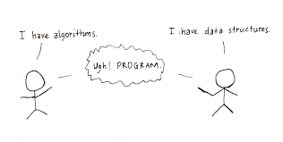

# C++ Algorithms and Data Structures Repository

This repository contains manual implementations of various algorithms and data structures in C++. Inside this repository, you'll discover programs showcasing the implementation of crucial data structures and algorithms from scratch.

## Repository Highlights

- **Thorough Implementations:** Explore codebases that showcase comprehensive implementations of fundamental algorithms and data structures, crafted by me. 

- **In-depth Documentation:** Each code file is accompanied by documentation, offering insights of the implementation. This documentation serves as a valuable resource for a deeper understanding of the underlying principles.

- **Educational Presentations:** Enhance your learning experience with informative presentations accompanying the code. These presentations provide a holistic view of how each data structure and algorithm functions :p

## Getting Started

To use the programs of this repository, all you need is a C++ compiler. The provided programs are designed not only to serve as functional code but also as educational tools. Whether you are a seasoned developer or a passionate learner, the repository caters to individuals with varying levels of expertise. 

## Contributing

I encourage contributions from the community to enrich this repository further. Feel free to engage in discussions, submit issues, or contribute your own implementations. Together, we can cultivate a valuable resource for the broader programming community.

Explore, learn, and contribute to the world of C++ algorithms and data structures!